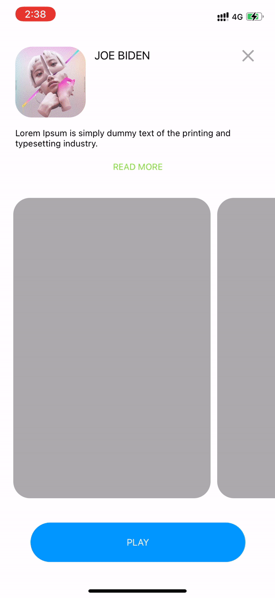

# Porsche Design

### WILL Be updating the demo files soon!

Demo animations practice project. Started as an internship interview task 😄

## What you will get in this project

Your following questions are answered in the project:

1. How to implement one to another view controller animation transition?

2. How to implement tap animation on collection view?

3. How to dismiss a view controller with swipe down gesture?

4. How to make a single UIButton perform different actions on multiple taps?

5. How to animate a UIButton and change it's colour with animation?

6. How to transform a view button to progress bar?

7. How to display a PopUp card and dismiss with swipe and tap gestures?

## Getting Started

To get started and run the app, you need to follow these simple steps:

1. Open the TaskZero workspace in Xcode.
2. Change the Bundle Identifier to match your domain.
3. Open the terminal, navigate to project folder and run "pod install". 
4. You're all set! Run TaskZero on your device or Simulator.

## Compatibility

This project is written in Swift 5.0, requires Xcode 12.0 to build and run.
TaskZero is compatible with devices running on iOS 14.0+.

## Author

* [Ankit Yadav](https://www.instagram.com/ankityddv/)

## License

Copyright 2020 Ankit Yadav.
Licensed under MIT License: https://opensource.org/licenses/MIT

## Current Status

Finished.
